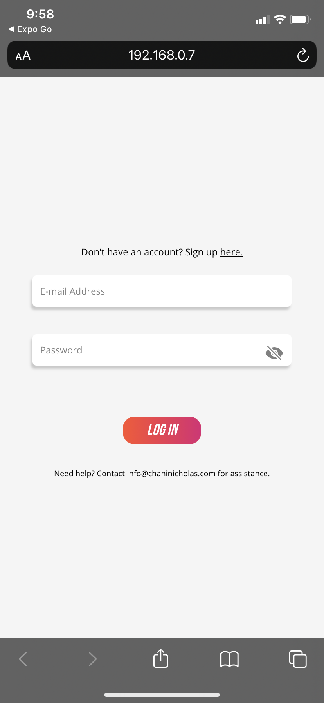
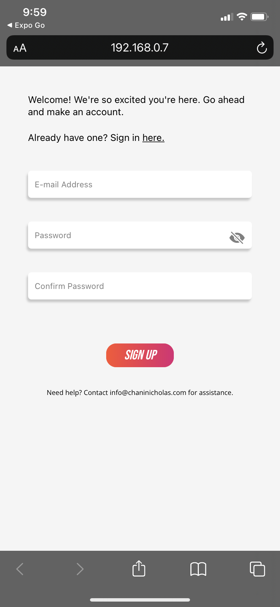
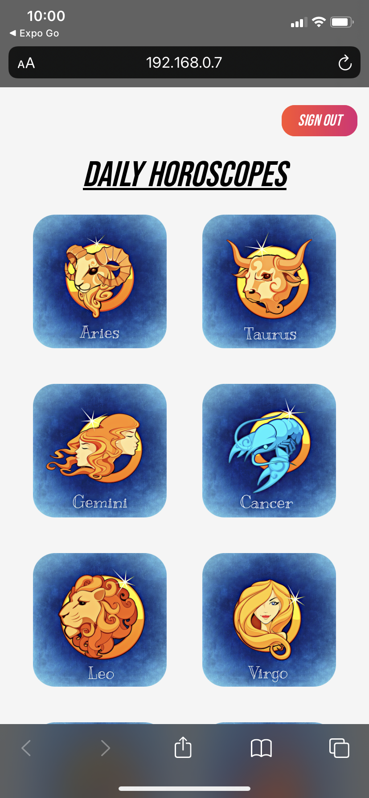
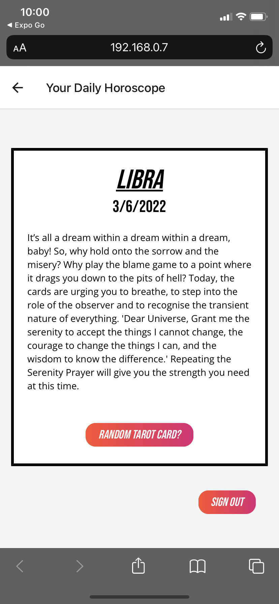
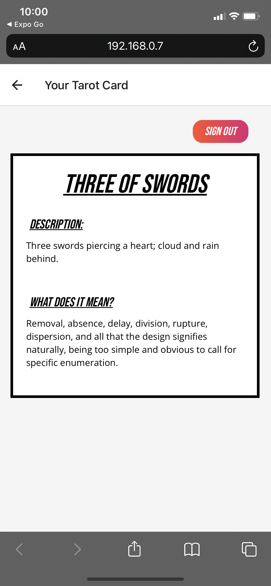

# My Astro App :)

My Astro App is a mobile app that allows a user to login or sign up and gain access to a list of all astrological signs. When "clicked", you see the daily horoscope for that sign. They also get an option to draw a random tarot card and read the results.

- Credentials to test:
  - E-Mail: test@email.com
  - Pass: testpass

Feel free to create your own user as well!

## Tech Stack:

- React Native
- Expo
- Firebase Authentication
- rws-tarot_card_api

## Getting Started:

### `npm install`

Install's all depencies.

### `expo start`

Runs the app via the expo server. Run "w" in the command line to open the project via web browser. Use responsive mode in dev tools for more accurate viewing. If you have the Expo app on your mobile device, you can also open the app and select the project running on localhost:19006 to view it. Expo docs can be found [here.](https://docs.expo.dev/)

## Things to Note

This app was designed using the CHANI astrology app as a reference. I tried to match the style and aesthetic with the purpose of demonstrating my ability to connect to a third party API, utilize locally stored data, re create designs and handle authentication.

## Screenshots:

Sign In Screen

Sign Up Screen

Horoscope List Screen

Detail aka Daily Horoscope Screen

Tarot Card Screen

## Future Goals

- Work on the real thing! :)

Hope you enjoy!

--Steph
